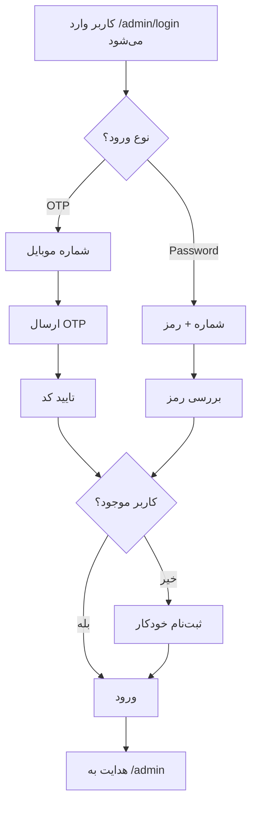

# 📊 پنل مدیریت PlusMeet

## 🎯 نمای کلی

پنل مدیریت PlusMeet یک رابط کاربری مدرن و حرفه‌ای برای مدیریت سامانه است که با تمرکز بر تجربه کاربری، عملکرد و زیبایی طراحی شده است.

---

## 🚪 ورود به پنل

### دو روش ورود

پنل مدیریت از دو روش احراز هویت پشتیبانی می‌کند:

#### 1️⃣ ورود با کد OTP (پیش‌فرض)

```
مسیر: /admin/login
روش: ارسال OTP به شماره موبایل
سرویس: SMS.ir
```

**مراحل:**

1. وارد کردن شماره موبایل (11 رقم)
2. دریافت کد 5 رقمی
3. وارد کردن کد تایید
4. ورود خودکار

**مزایا:**

- ✅ امن‌تر (بدون نیاز به حفظ رمز عبور)
- ✅ راحت‌تر برای کاربران
- ✅ ثبت‌نام خودکار کاربران جدید

#### 2️⃣ ورود با رمز عبور

```
مسیر: /admin/login (تب دوم)
روش: شماره موبایل + رمز عبور
```

**مراحل:**

1. وارد کردن شماره موبایل
2. وارد کردن رمز عبور
3. ورود

**مزایا:**

- ✅ سریع‌تر (بدون انتظار برای SMS)
- ✅ مناسب برای کاربران مکرر

---

## 🏗️ ساختار پنل

### صفحات اصلی

```
/admin
├── /login              # صفحه ورود (OTP + Password)
├── /                   # داشبورد اصلی
├── /users              # مدیریت کاربران
├── /events             # مدیریت رویدادها
├── /reports            # گزارش‌ها و آمار
└── /settings           # تنظیمات سیستم
```

### Layout ساختار

```jsx
AdminLayout
├── Sidebar (کشویی)
│   ├── Logo & Toggle
│   ├── Navigation Menu
│   └── User Info + Logout
└── Main Content Area
    └── {children}
```

---

## 📱 رسپانسیو

پنل در 3 سطح responsive است:

| سایز        | عرض        | تنظیمات                    |
| ----------- | ---------- | -------------------------- |
| **Desktop** | > 1024px   | Sidebar ثابت در کنار محتوا |
| **Tablet**  | 768-1023px | Sidebar کشویی              |
| **Mobile**  | < 768px    | Sidebar تمام صفحه          |

---

## 🎨 طراحی UI/UX

### کامپوننت‌های اصلی

#### 1. صفحه لاگین (`/admin/login/page.js`)

- **دو تب**: OTP / Password
- **انیمیشن**: Fade-in, Slide-up
- **رنگ‌بندی**: Gradient (Primary → Accent)
- **وضعیت‌ها**: Loading, Error, Success
- **تایمر**: Countdown برای OTP

#### 2. Layout ادمین (`/admin/layout.js`)

- **Sidebar**: قابل جمع شدن
- **Navigation**: آیکون + متن
- **User Profile**: Avatar + نام + نقش
- **حالت فعال**: رنگ Primary با Shadow

#### 3. داشبورد (`/admin/page.js`)

**آمارهای سریع (Stats Cards):**

- کاربران فعال
- رویدادهای فعال
- درآمد این ماه
- گزارش‌های جدید

**دسترسی سریع (Quick Actions):**

- افزودن کاربر
- رویداد جدید
- گزارش‌ها
- تنظیمات

**فعالیت‌های اخیر:**

- لیست آخرین فعالیت‌ها
- آیکون‌های رنگی بر اساس نوع
- زمان نسبی (X دقیقه پیش)

---

## 🎨 استایل‌ها

### متغیرهای CSS مورد استفاده

```css
/* رنگ‌ها */
--color-primary: #F4A325
--color-accent: #FFC15E
--color-bg-default: #F5E6C8
--color-bg-secondary: #FFFFFF
--color-text-primary: #18333C

/* سایه‌ها */
--shadow-lg: 0 10px 15px -3px rgba(...)

/* انیمیشن */
--transition-base: 200ms
```

### انیمیشن‌ها

#### Login Page

```css
@keyframes fadeInUp {
  from: opacity 0, translateY(30px)
  to: opacity 1, translateY(0)
}
```

#### Dashboard

```css
@keyframes fadeIn {
  from: opacity 0
  to: opacity 1
}
```

---

## 🔐 امنیت

### Middleware

```javascript
// در layout.js
useEffect(() => {
  if (!isAuthenticated) {
    router.push("/admin/login");
  }
}, [isAuthenticated]);
```

### Token Management

- **Access Token**: JWT با expire کوتاه
- **Refresh Token**: برای تمدید خودکار
- **Storage**: LocalStorage + Context

---

## 📦 فایل‌ها

```
src/app/admin/
├── login/
│   ├── page.js            # صفحه ورود
│   └── login.module.css   # استایل لاگین
├── layout.js              # Layout کلی ادمین
├── admin.module.css       # استایل Layout
├── page.js                # داشبورد
└── dashboard.module.css   # استایل داشبورد
```

---

## 🚀 استفاده

### ورود اولیه (Admin)

برای ایجاد کاربر admin اولیه:

```bash
node scripts/create-admin.js
```

**اطلاعات پیش‌فرض:**

- شماره: `09123456789`
- رمز: `admin123`

### تست در Development

```bash
npm run dev
```

سپس به آدرس زیر بروید:

```
http://localhost:3000/admin/login
```

---

## 🎯 نقش‌ها و دسترسی‌ها

| نقش           | دسترسی                      |
| ------------- | --------------------------- |
| **Admin**     | همه بخش‌ها                  |
| **Moderator** | کاربران، رویدادها، گزارش‌ها |
| **User**      | فقط پروفایل شخصی            |

---

## 🔄 فلوی ورود کامل



---

## 📸 اسکرین‌شات‌ها

### صفحه لاگین

- **تب OTP**: فرم ساده با دکمه "دریافت کد"
- **تب Password**: فرم با نمایش/مخفی رمز

### داشبورد

- **Stats Grid**: 4 کارت با آیکون و رنگ منحصر
- **Quick Actions**: 4 دکمه دسترسی سریع
- **Recent Activities**: لیست فعالیت‌ها با آیکون

### Sidebar

- **حالت باز**: لوگو + متن منو + پروفایل
- **حالت بسته**: فقط آیکون‌ها

---

## 🛠️ توسعه آینده

### فیچرهای در دست توسعه:

- [ ] صفحه مدیریت کاربران
- [ ] صفحه مدیریت رویدادها
- [ ] صفحه گزارش‌ها با نمودار
- [ ] تنظیمات سیستم
- [ ] نوتیفیکیشن Real-time
- [ ] چت پشتیبانی

---

## 🐛 رفع مشکلات رایج

### 1. نمی‌توانم وارد شوم

```
راه‌حل:
1. اطمینان از وجود MongoDB
2. بررسی متغیرهای .env
3. بررسی console برای خطا
```

### 2. OTP ارسال نمی‌شود

```
راه‌حل:
1. بررسی API Key در .env
2. بررسی Template ID
3. در حالت Development: کد در console چاپ می‌شود
```

### 3. Sidebar کار نمی‌کند

```
راه‌حل:
1. Clear cache مرورگر
2. بررسی console برای خطای JS
```

---

## 📞 پشتیبانی

مشکلی پیش آمد؟ فایل‌های زیر را بررسی کنید:

- `docs/GETTING_STARTED.md`
- `docs/SMS_SETUP.md`
- `docs/RBAC_GUIDE.md`

یا به `CHANGELOG.md` برای تغییرات اخیر مراجعه کنید.


